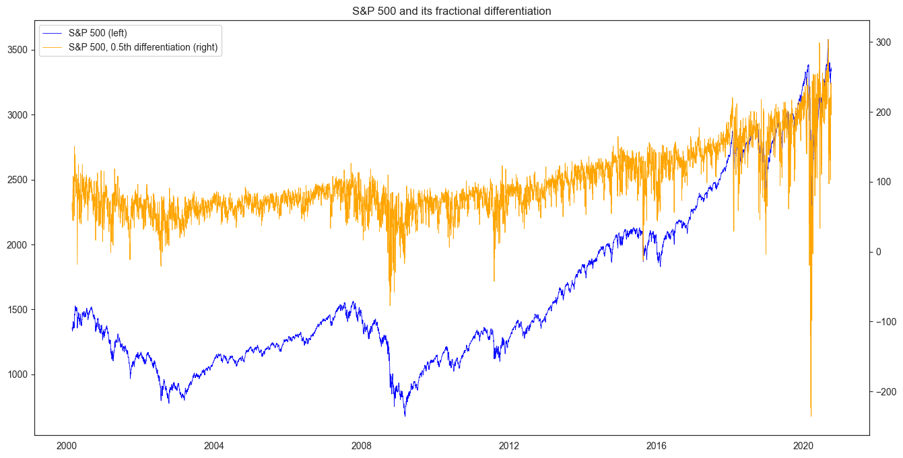
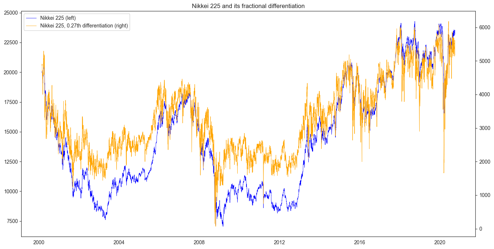

# Fracdiff: Super-fast Fractional Differentiation

[](https://pypi.org/project/fracdiff)
[](https://pypi.org/project/fracdiff)
[](https://github.com/fracdiff/fracdiff/actions/workflows/ci.yml)
[](https://codecov.io/gh/fracdiff/fracdiff)
[](https://pypi.org/project/fracdiff)
[](https://github.com/psf/black)

[Documentation](https://fracdiff.github.io/fracdiff/)

***Fracdiff*** performs fractional differentiation of time-series,
a la "Advances in Financial Machine Learning" by M. Prado.
Fractional differentiation processes time-series to a stationary one while preserving memory in the original time-series.
Fracdiff features super-fast computation and scikit-learn compatible API.



## What is fractional differentiation?

See [M. L. Prado, "Advances in Financial Machine Learning"][prado].

## Installation

```sh
$ pip install fracdiff
```

## Features

### Functionalities

- `fdiff`: A function which extends [`numpy.diff`](https://numpy.org/doc/stable/reference/generated/numpy.diff.html) to fractional orders.
- `Fracdiff`: Perform fracdiff of a set of time-series. Compatible with scikit-learn API.
- `FracdiffStat`: Automatically fracdiff which makes a set of time-series stationary while preserving their maximum memory. Compatible with scikit-learn API.

### Speed

Fracdiff is blazingly fast.

The following graphs show that *Fracdiff* computes fractional differentiation much faster than the "official" implementation.

It is especially noteworthy that execution time does not increase significantly as the number of time-steps (`n_samples`) increases, thanks to NumPy engine.


The following tables of execution times (in unit of ms) show that *Fracdiff* can be ~10000 times faster than the "official" implementation.

|   n_samples | fracdiff       | official             |
|------------:|:---------------|:---------------------|
|         100 | 0.164 +- 0.088 | 20.725 +- 5.323      |
|        1000 | 0.162 +- 0.055 | 108.049 +- 3.612     |
|       10000 | 0.268 +- 0.085 | 1074.970 +- 89.375   |
|      100000 | 0.779 +- 0.241 | 12418.813 +- 453.551 |

|   n_features | fracdiff        | official                |
|-------------:|:----------------|:------------------------|
|            1 | 0.162 +- 0.055  | 108.049 +- 3.612        |
|           10 | 0.229 +- 0.036  | 1395.027 +- 172.948     |
|          100 | 1.745 +- 0.196  | 13820.834 +- 821.352    |
|         1000 | 19.438 +- 2.093 | 154178.162 +- 11141.337 |

(Run on Macbook Air 2018, 1.6 GHz Dual-Core Intel Core i5, 16 GB 2133 MHz LPDDR3)

## How to use 

[](https://colab.research.google.com/github/fracdiff/fracdiff/blob/main/examples/example_howto.ipynb)

### Fractional differentiation

A function `fdiff` calculates fractional differentiation.
This is an extension of `numpy.diff` to a fractional order.

```python
import numpy as np
from fracdiff import fdiff

a = np.array([1, 2, 4, 7, 0])
fdiff(a, n=0.5)
# array([ 1.       ,  1.5      ,  2.875    ,  4.6875   , -4.1640625])
np.array_equal(fdiff(a, n=1), np.diff(a, n=1))
# True

a = np.array([[1, 3, 6, 10], [0, 5, 6, 8]])
fdiff(a, n=0.5, axis=0)
# array([[ 1. ,  3. ,  6. , 10. ],
#        [-0.5,  3.5,  3. ,  3. ]])
fdiff(a, n=0.5, axis=-1)
# array([[1.    , 2.5   , 4.375 , 6.5625],
#        [0.    , 5.    , 3.5   , 4.375 ]])
```

### Preprocessing by fractional differentiation

A transformer class `Fracdiff` performs fractional differentiation by its method `transform`.

```python
from fracdiff import Fracdiff

X = ...  # 2d time-series with shape (n_samples, n_features)

f = Fracdiff(0.5)
X = f.fit_transform(X)
```

For example, 0.5th differentiation of S&P 500 historical price looks like this:


`Fracdiff` is compatible with scikit-learn API.
One can imcorporate it into a pipeline.

```python
from sklearn.linear_model import LinearRegression
from sklearn.preprocessing import StandardScaler
from sklearn.pipeline import Pipeline

X, y = ...  # Dataset

pipeline = Pipeline([
    ('scaler', StandardScaler()),
    ('fracdiff', Fracdiff(0.5)),
    ('regressor', LinearRegression()),
])
pipeline.fit(X, y)
```

### Fractional differentiation while preserving memory

A transformer class `FracdiffStat` finds the minumum order of fractional differentiation that makes time-series stationary.
Differentiated time-series with this order is obtained by subsequently applying `transform` method.
This series is interpreted as a stationary time-series keeping the maximum memory of the original time-series.

```python
from fracdiff import FracdiffStat

X = ...  # 2d time-series with shape (n_samples, n_features)

f = FracdiffStat()
X = f.fit_transform(X)
f.d_
# array([0.71875 , 0.609375, 0.515625])
```

The result for Nikkei 225 index historical price looks like this:



[](https://colab.research.google.com/github/fracdiff/fracdiff/blob/main/examples/example_prado.ipynb)

Other examples are provided [here](examples/example_prado.ipynb).

[](https://colab.research.google.com/github/fracdiff/fracdiff/blob/main/examples/example_exercise.ipynb)

Example solutions of exercises in Section 5 of "Advances in Financial Machine Learning" are provided [here](examples/example_exercise.ipynb).

## Contributing

Any contributions are more than welcome.

The maintainer (simaki) is not making further enhancements and appreciates pull requests to make them.
See [Issue](https://github.com/fracdiff/fracdiff/issues) for proposed features.
Please take a look at [CONTRIBUTING.md](.github/CONTRIBUTING.md) before creating a pull request.

## References

- [Marcos Lopez de Prado, "Advances in Financial Machine Learning", Wiley, (2018).][prado]

[prado]: https://www.wiley.com/en-us/Advances+in+Financial+Machine+Learning-p-9781119482086
